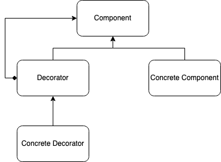

# Decorator Desing Pattern Example

You can click [on this link](https://medium.com/@ademcatamak/decorator-design-pattern-f282ddc2ce23 "Decorator Design Pattern") to access my medium post about Decorator design pattern, one of the structural design patterns.

## Development Environment

[ASP.NET 3.1 SDK](https://dotnet.microsoft.com/download/dotnet-core/3.1) is used during project development. In order to run the sample project easily, the in-memory database and in-memory cache service are used. As a result, [ASP.NET 3.1 SDK](https://dotnet.microsoft.com/download/dotnet-core/3.1) is the only requirement for running this project.

